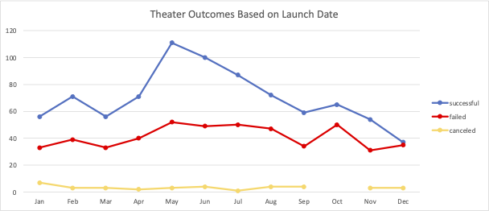
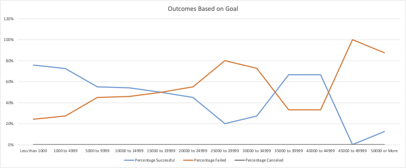

# Kickstarting with Excel
Analysis of historical Kickstarter data for Louise

## Overview of Project
Louise chose Kickstarter to fund her new play Fever. Unfortunately, her funding fell short in her funding window. Now Louise wants to know more informantion about Kickstarting Play Campaigns to better inform her future investment decisions.

### Purpose
For Louise, and her specific interest in Plays, the most important metric is Outcomes, i.e., whether a project succeeded, failed, or was canceled. This analysis will chart Outcomes on the basis of Project Launch Date (monthly calendar year) and Project Funding Goal (how much the investee asked in funding).   

## Analysis and Challenges
These analyses are straight from the BootCamp guidelines. The dates of the data range for Project Launch Date are from 5/17/09 to 3/15/17 and for Project Completion Date are 8/10/09 to 5/3/17.

### Analysis of Outcomes Based on Launch Date
- Rename to Kickstarter_Challenge.xlsx the prior file data-1-1-3-StarterBook.xlsx
- Create a directory "resources" for the two PNGs
- In the Kickstarter_Challenge.xlsx workbook, create a new column labeled "Years."
- In the "Years" column, use the YEAR() function to extract the year from the “Date Created Conversion” column
- Create a pivot table from the KickStarter worksheet and place the pivot table in a new sheet.
- Label the sheet "Theater Outcomes by Launch Date."
- Filter the pivot table based on "Parent Category" and "Years."
- Place the appropriate pivot table fields in the columns, rows, and values.
- Filter the column labels to show only "successful," "failed," and "canceled."

### Analysis of Outcomes Based on Goals
- In the KickStarter sheet, create a new sheet and label it "Outcomes Based on Goals."
- In the new sheet, create the following columns to hold the data:
    - Goal
    - Number Successful
    - Number Failed
    - Number Canceled
    - Total Projects
    - Percentage Successful
    - Percentage Failed
    - Percentage Canceled
- In the “Goal” column, create the following dollar-amount ranges so projects can be grouped based on their goal amount.
- Use COUNTIFS() functions to populate the "Number Successful," "Number Failed," and "Number Canceled" columns by filtering on the Kickstarter "outcome" column, on the "goal" amount column using the ranges created in Step 3, and on the "Subcategory" column using "plays" as the criteria.
- Use the SUM() function to populate the "Total Projects" column with the number of successful, failed, and canceled projects for each row.
- Calculate the percentage of successful, failed, and canceled projects for each row.
- Create a line chart titled "Outcomes Based on Goal" to visualize the relationship between the goal-amount ranges on the x-axis and the percentage of successful, failed, or canceled projects on the y-axis.
- Confirm that your line chart looks like the following, and save it as Outcomes_vs_Goals.png to the resources folder. Your "Outcomes Based on Goal" line chart helped me fix this problem.

### Challenges and Difficulties Encountered
- I struggled with the Mac interface. I have not used a Mac in over 20 years.
- Oof. It takes longer to write the README.md than to write the code.
- I initially used Pledged and not Goal in the spreadsheet. 
- I could not distinguish the "canceled" data from the x-axis in the line chart line color
    - I re-adjusted the y-axis to include negative values
- N is small over $25,000 (N = 42 out of a total of N = 1047 over), which raises concerns about the statistical validity.
- My compressed zip file is the same size as the original (1.7 MB)

## Results

### Results of Outcomes Based on Launch Date
Spring and summer (May through August) appear to be the peak times for successful funding. Not surprisingly, these times are also peaks for failed funding. If we assume that the percentage of successful campaigns is roughly that of failed campaigns (data not analyzed), it appears that spring and summer is when most investors choose to fund or when most investees request funding. Most Kicktarter investors or Kickstarter investees either know that the spring-summer window is ripe, or that their choice to invest is determined by the seasons. If Louise wants to maximize her efforts at a successful Kickstarter Campaign based on the historical data, she should pitch her Project Funding Goal during the months of May through August.

### Results of Outcomes Based on Goals
There appear to be two ways to lauch a Kickstarter Campaign. Goals less than $5000 succeed more often than not. Goals greater than or equal to $50000 succeed less often than not. Goals less than $5000 fail more often than not. Goals greater than or equal to $50000 fail more often than not. If Louise wants to maximize her efforts at a successful Kickstarter Campaign based on the historical data, she should pitch her Project Funding Goal at less than $10,000.

### Data Limitations
- N is small over $25,000 (N = 42 over 6 categories out of a total of N = 1047 over 12 categories), which raises concerns about statistical validity.

### Can we do more?
- It would be interesting to look at "Outcomes Based on Goal" vs "Outcomes Based on Pledged" as a function of "Outcomes Based on Goal" requested funding. Do successful projects get well funded when the asking price, i.e. goal, is low (less than $10,000)? Do failed projects not get funded when the asking price, i.e. goal, is high (greater than or equal to $45,000)?